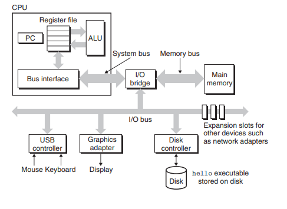
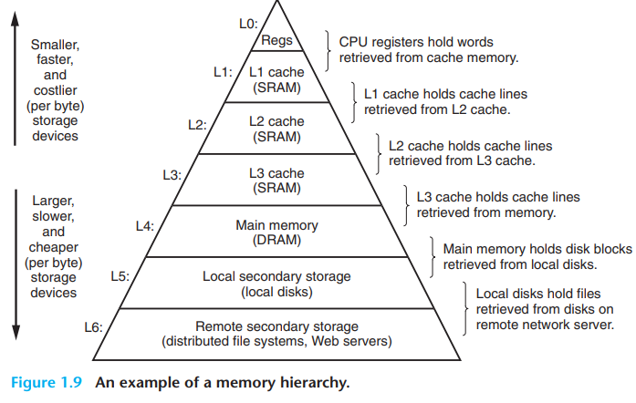
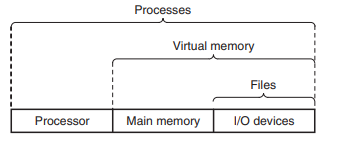
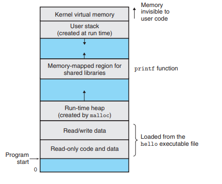

# A tour of computer systems

## 1.1 information is Bits

A simple hello world program is at the end of the day series of bits organized into bytes which the computer can understand. In the case of the hello world program the individual characters are translated into ascii characters. How the OS and the compilers will run such program is beyond this section but it is important to understand that you programs are not some hovering abstraction detached of your computers.

## 1.2 Programs are Translated by other programs into different from's

You simple hello.c file needs to be converted into something you os can run via the compiler. The compiler is a program that can do just that, the steps of which are the following.

1. preprocessor
   - This part is where you program reads the original source file and looks for place like the `#include <stdio.h>` the proceeds to include stdio header file into your source code. The output of this is: `hello.i`
2. compiler
   - the compiler the takes this preprocessed file then changes it into an assembly file which the assembler can your can convert into machine instructions. The output of this is: `hello.s`
3. Assembler
   - The assembler takes you assembly file then turns into machine code then packages in to a form known as **relocatable object program** and stores the result in `hello.o` which is a binary file that is executable.
4. Linker
   - The linker takes your `hello.o` file then calls other linked library files like print that you may have included in you source code. Basically handles the merging various relocatable object programs that call on each other.

## 1.3 It pays to understand how compilation systems work

Often times compiler produce good code that runs efficiently but sometimes your code may run slower than you would like and a knowledge of how compilers work would server you well.

- Are if statements faster than switches
- why are local variables faster the argument variables to a function
- why are some sequence of operations faster than others
  Are examples of some question that would be impossible to answer fully without knowledge of how compilers work.
  other problems are linking errors and avoiding security holes like buffer overflow.

## 1.4 Processors Read and Interpret Instructions Stored in Memory

1. Buses
   - Buses carry information back and forth between systems in fixed word sizes. A word is a unit of information the is uniform across the system, most device have either a 4byte or 8byte word size.
2. I/O Devices
   - I/O devices like keyboards and monitors either have adapters or controllers. Controllers are either chips on the device itself or part of the motherboard of the device used to interact with the computer. while adapters are additions to a the pc to communicate with the device.
3. Main Memory
   - Main memory consists of DRAM chips which can be treated as long array of bits which can be indexed using offsets and tables.
4. Processor
   - The processor executes instruction which the program counter is on. Each instruction is a fixed word count and after each instruction is executed we move the program counter forward. In addition the program count can access parts of memory and manipulate is via the ALU, the ALU computes new data and address values.

When out computer runs the hello world program the steps it takes are as follows:

- enter the command `./hello` and press enter which tell the shell to run such file
- the system then loads the hello program in to main memory from disk
- then the bus interface can load the program from memory to the PC(program counter) registers
- then the program counter executes the machine code.

## 1.5 Caches Matter

A large part of time it takes to execute out hello world program is loading it from memory and into the PC to execute. Loading things from memory can be many orders of magnitude slower than executing the instruction. This means that if you improve the speed at which you access your memory you improve your programs performance. But there is a trade of hear the faster it is to access memory the smaller it is. that being said cpu's store pieces of memory that are often accessed together is smaller and faster to access places called caches, localized regions. caches are called Static random access memory (SRAM).

One cool thing about knowing how caches work is that you can use this knowledge to make you programs run faster, which we will explore in chapter 6.

## 1.6 Storage Devices for Hierarchy

what is said above is enough ^^^^^.

## 1.7 The Operating System Manages the Hardware

The operating system is an abstraction between hardware and software
that enables programers to write code without needing to know the intricacy of the various hardware components in their computer.

The abstraction takes the following shape

### Processes

A processes is an abstraction on top of a CPU core which acts as a sandbox environment where the user software runs. The actual cpu constantly switches between processes, when it switches between processes it stores the processes state so when it switches back it can continue where it left off.

### Virtual memory

Virtual memory is an abstraction on top of the RAM, it provides programs with there own space on top of the RAM that they can access

### Files

All IO interaction are abstracted away into file interactions that the programer can call and the os will execute the necessary commands to work correctly with your computers IO devices.

## 1.9 Important themes

### Amdahl's Law

Amdahl's law is a observation of how a systems overall performance is improved after an improvement has been made to on part of the systems.
So lets say there is a processes that takes $T_{old}$ time and it is need $\alpha$ of the time, ratio of the time it is used. Now if we improved the old time by a factor of $k$ then the individual process improved from $\alpha T_{old}$ to $(\alpha T_{old})/k$.
So now the new time it takes is $T_{new} = (1-\alpha)*T_{old} +(\alpha*T_{old})/k$
And the overall speed up is just the ratio of the $T_{new}/T_{old}$ this which simplifies to:

$$
\frac{1}{(1-\alpha)+\alpha/k}
$$

### Concurrency and Parallelism

Concurrency is when a processor switches between various tasks at the same time, an example is using ur computer to listen to music and type out a doc. There are various types of Concurrency

1. Uniprocessor
   Is when a computer has one core and that quickly switches between processes while keep intact the state of each process, the analogy is having a single juggler.
2. Multi-Processor systems
   this is when a cpu has multiple cores and each core has its own L1, L2 cache and share L3 and main memory, the analogy is having multiple jugglers.
3. Hyperthreading
   Like having one super-efficient juggler who can handle multiple balls with minimal switching time
   Can switch tasks every single tick of the computer's clock
   Uses some duplicate hardware but shares other parts
   For example, a 4-core processor with hyperthreading can handle 8 tasks simultaneously

Parallelism is when a cpu executes more than one instruction at once enabling two control flows to exists at once, will explore this more in later chapters.
